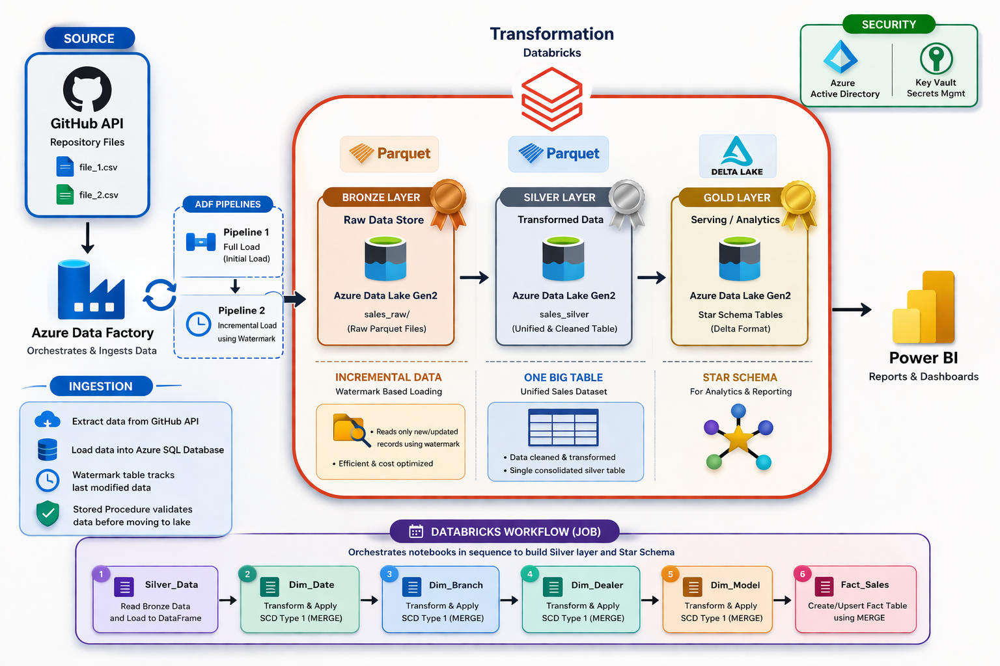
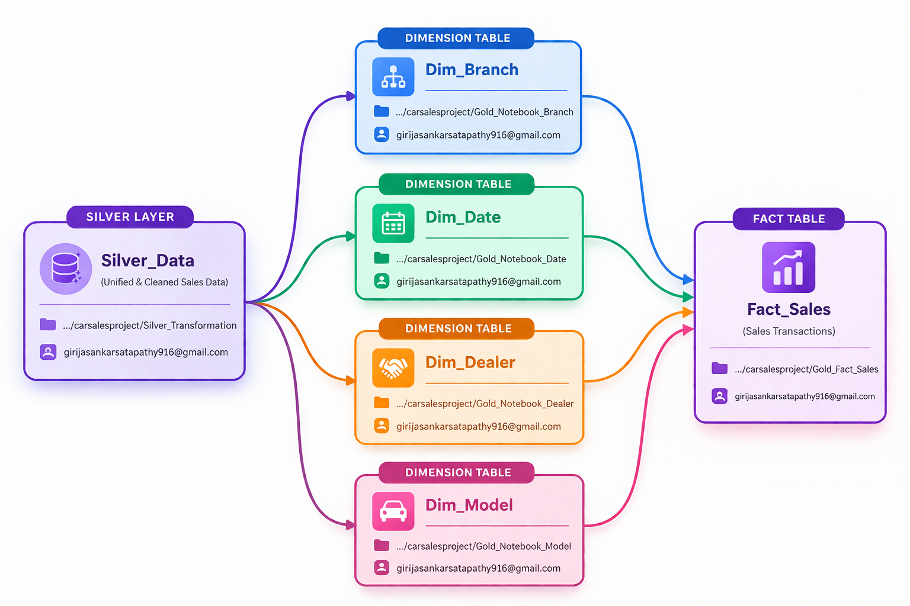

# 📌 End-to-End Azure Data Engineering Pipeline
## 🚀 Project Overview

- This project demonstrates a complete end-to-end data engineering pipeline built on Azure, covering data ingestion, transformation, modeling, and orchestration using industry best practices.
- The pipeline ingests data from GitHub, processes it through a Medallion Architecture (Bronze → Silver → Gold), and builds a star schema data warehouse for analytics.

# 🏗️ Architecture

# 🧰 Tech Stack
- Azure Data Factory (ADF) – Data ingestion & orchestration
- Azure Databricks – Data transformation using PySpark
- Azure SQL Database – Staging, watermark tracking, validation
- Azure Data Lake Storage Gen2 (ADLS) – Data storage (Bronze layer)
- PySpark & SQL – Data processing and transformations
  
# ⚙️ Key Features
### 🔹 Data Ingestion
- Extracted data from GitHub API (multiple files)
- Loaded data into Azure SQL Database using ADF Copy Activity
### 🔹 Incremental Loading
- Implemented watermark-based incremental loading
- Stored watermark values in SQL table
- Ensured only new/updated data is processed
### 🔹 Data Validation
- Used SQL Stored Procedures to validate data integrity before processing
### 🔹 Medallion Architecture
- Bronze Layer: Raw data stored in ADLS
- Silver Layer: Cleaned and transformed data in Databricks
- Gold Layer: Business-ready data modeled as star schema
### 🔹 Data Transformation (Databricks)
- Performed transformations using PySpark
- Created a unified sales dataset (Silver layer)
### 🔹 Data Modeling
- Designed and implemented Star Schema
  - 1 Fact Table
  - 4 Dimension Tables
### 🔹 SCD Type 1 Implementation
- Used MERGE (Upsert) logic in Databricks
- Ensured latest data updates without historical tracking
### 🔹 Workflow Orchestration
- Built end-to-end pipeline using Databricks Workflows
- Automated execution of notebooks
    

#  🔄 Pipeline Flow
1. ADF extracts data from GitHub API
2. Loads data into Azure SQL Database
3. Uses watermark table for incremental data loading
4. Validates data using stored procedures
5. Stores raw data in ADLS (Bronze layer)
6. Databricks processes and transforms data (Silver layer)
7. Builds star schema (Gold layer)
8. Databricks workflows orchestrate entire pipeline

# 📊 Use Cases
- Building scalable ETL pipelines
- Implementing incremental data loading
- Designing data warehouse using star schema
- Learning Azure + Databricks integration
